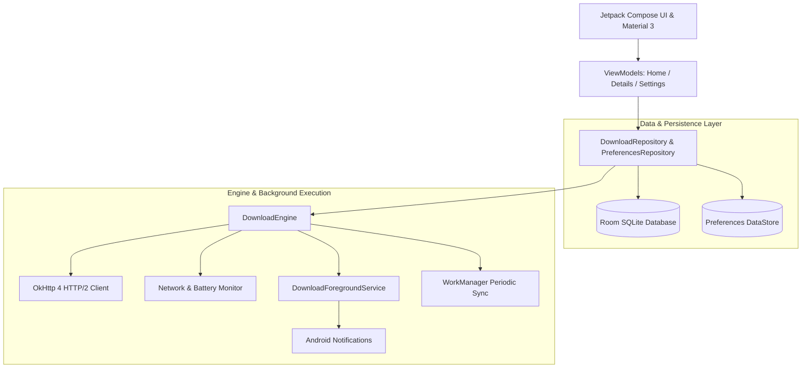

<div align="center">


# Pegion
### Native, Blazing-Fast & Privacy-First Android Download Manager

*Always delivers. Fast, robust, resume-ready downloads with speed controls, queues, and checksum verification.*

[](https://opensource.org/licenses/Apache-2.0)
[-3DDC84.svg?logo=android&logoColor=white)](https://android.com)
[](https://kotlinlang.org)
[](https://developer.android.com/jetpack/compose)
[](#philosophy)

[**Features**](#-key-features) • [**Architecture**](#-architecture--tech-stack) • [**Comparison**](#-how-pegion-compares) • [**Getting Started**](#-getting-started) • [**Building**](#-building-from-source) • [**Roadmap**](#-roadmap)

---

</div>

## 📖 Overview

**Pegion** is a native Android download manager inspired by the carrier pigeons of old: reliable, resilient, respectful of system resources, and fundamentally private.

Unlike commercial download managers that flood your screen with intrusive ads, background trackers, and unnecessary bloat, **Pegion is 100% free, open-source, and zero-telemetry**. It gives you complete control over your bandwidth, storage, and active download queues through a modern Material Design 3 interface.

---

## ⚡ Key Features

### 🚀 Resilient Download Engine
- **Pause & Resume Anywhere:** Automatic range requests (`bytes=X-`) preserve progress even across abrupt network loss, device restarts, and airplane mode transitions.
- **Intelligent Queue Scheduling:** Configurable concurrent download limits (1 to 5 concurrent streams) with priority routing (`HIGH`, `NORMAL`, `LOW`).
- **Speed Limits & Throttle Controls:** Set global or per-download bandwidth limits to preserve internet for gaming, streaming, or video calls.
- **Background Persistence:** Powered by Android `ForegroundService` with `DATA_SYNC` type and `WorkManager` for guaranteed background execution.

### 🛡️ Integrity & Security
- **Checksum Verification:** Built-in hash verification supporting **SHA-256**, **MD5**, and **SHA-1** to ensure downloaded files are bit-for-bit identical to source files and free from corruption or tampering.
- **Zero Telemetry & Offline-First:** No analytics SDKs, no trackers, no third-party network pipelines. All data stays strictly on your device.

### 🎨 Material 3 Expressive UI & UX
- **Dynamic Theming:** Supports **System Default**, crisp **Light**, deep space **Dark**, and pure pitch **AMOLED** mode (0% black for OLED power savings).
- **Real-Time Speed Telemetry:** Smooth Bézier speed graph visualization monitoring live throughput and instantaneous ETA calculations.
- **Smart Clipboard Detection:** Auto-detects downloadable URLs when copied to your clipboard and offers one-tap downloading.
- **System Share Receiver:** Send links directly to Pegion from Chrome, Firefox, Brave, or any app via the native Android Share sheet.
- **Batch Download Mode:** Paste multiple URLs separated by newlines to queue massive download jobs in seconds.

### 🔋 Battery & Network Policies
- **Wi-Fi Only Mode:** Avoid accidental mobile data usage by restricting downloads to Wi-Fi networks.
- **Charging Only Mode:** Defer power-heavy downloads until your device is plugged into a power source.
- **Auto-Pause on Disconnect:** Immediately pauses downloads when leaving Wi-Fi or losing internet connectivity, resuming seamlessly once connected.

---

## 📊 How Pegion Compares

| Feature | 🕊️ Pegion | Stock Android DM | ADM / 1DM |
| :--- | :---: | :---: | :---: |
| **Ads & Trackers** | ❌ **Zero (Ad-Free & Private)** | ❌ None | ⚠️ Heavy Ads & Tracking |
| **Open Source** | ✅ **Apache-2.0** | ⚠️ AOSP Base Only | ❌ Proprietary Closed Source |
| **Resume Interrupted Streams** | ✅ **Yes (HTTP Range)** | ⚠️ Limited | ✅ Yes |
| **Custom Speed Limits** | ✅ **Yes (Global + Per-Task)** | ❌ No | ✅ Yes |
| **Checksum Verification (SHA/MD5)**| ✅ **Built-in** | ❌ No | ⚠️ Rare / Complex |
| **Speed Telemetry Graph** | ✅ **Live Bézier Canvas** | ❌ No | ⚠️ Basic |
| **Pure AMOLED Pitch Black** | ✅ **Yes** | ❌ No | ⚠️ Paid Feature |
| **Modern Jetpack Compose** | ✅ **100% Compose M3** | ❌ Legacy Views | ❌ Legacy Views |

---

## 🏗️ Architecture & Tech Stack

Pegion is built adhering strictly to modern Android development (MAD) guidelines:



### Key Libraries & Components
- **UI & Toolkit:** [Jetpack Compose](https://developer.android.com/jetpack/compose) with Material 3 Expressive palette.
- **Language & Concurrency:** [Kotlin 2.2](https://kotlinlang.org) with Coroutines and asynchronous `Flow` pipelines.
- **Local Persistence:** [Room SQLite](https://developer.android.com/training/data-storage/room) for download state and history.
- **Preferences:** [Jetpack DataStore](https://developer.android.com/topic/libraries/architecture/datastore) for type-safe settings storage.
- **Networking:** [OkHttp 4](https://square.github.io/okhttp/) with chunked stream buffers, custom `User-Agent`, and range request support.
- **Background Tasks:** Android `ForegroundService` with `FOREGROUND_SERVICE_TYPE_DATA_SYNC` and `WorkManager`.

---

## 📥 Getting Started

### Download the APK
Pre-built APKs are available in the [**Releases**](https://github.com/keshavshiyal/pegion/releases) section.
1. Download the latest `pegion-release.apk` (or `pegion-debug.apk`).
2. Open the file on your Android device (ensure "Install from Unknown Sources" is enabled in system settings).
3. Open Pegion, grant the notification permission, and paste your first download link!

---

## 🛠️ Building from Source

### Prerequisites
- **JDK 17** (Temurin or OpenJDK recommended)
- **Android SDK** with Platform API 36 installed
- **Android Studio Ladybug (2024.2+)** or command line tools

### Build Steps

1. **Clone the repository:**
   ```bash
   git clone https://github.com/keshavshiyal/pegion.git
   cd pegion
   ```

2. **Setup environment variables:**
   ```bash
   cp .env.example .env
   ```

3. **Build the Debug APK:**
   ```bash
   # On Linux/macOS:
   ./gradlew assembleDebug

   # On Windows PowerShell:
   .\gradlew.bat assembleDebug
   ```
   The APK will be generated at `app/build/outputs/apk/debug/app-debug.apk`.

4. **Run Unit Tests:**
   ```bash
   ./gradlew testDebugUnitTest
   ```

---

## 🗺️ Roadmap

- [x] Resilient HTTP range-based download resumption.
- [x] In-app speed telemetry chart and ETA calculator.
- [x] SHA-256 and MD5 checksum verifier.
- [x] Clipboard auto-detection & Android system share receiver.
- [x] Dark & True AMOLED black themes.
- [ ] **Multi-Segment Parallel Engine:** 4–8 concurrent connections per file for 3x–10x download speeds.
- [ ] **M3 Modal Bottom Sheet:** Async probing of file name, size, and resume support on paste.
- [ ] **Segmented Chunk Visualizer:** Real-time visual progress of individual download threads.
- [ ] **Scoped Storage / MediaStore:** Automatic integration with Android's native Downloads collection.
- [ ] **Quick Settings Tile:** Trigger download directly from the system pull-down tray.
- [ ] **F-Droid & IzzyOnDroid Submission:** Available directly in open-source app repositories.

---

## 🤝 Contributing

Contributions make the open-source community an amazing place to learn, inspire, and create! Any contributions you make are **greatly appreciated**.

1. Fork the Project.
2. Create your Feature Branch (`git checkout -b feature/AmazingFeature`).
3. Commit your Changes (`git commit -m 'feat: Add AmazingFeature'`).
4. Push to the Branch (`git push origin feature/AmazingFeature`).
5. Open a Pull Request.

---

## 📄 License

Distributed under the **Apache License 2.0**. See `LICENSE` for more information.

---

<div align="center">
  <sub>Crafted with passion for the open-source community by <a href="https://github.com/keshavshiyal">Keshav Shiyal</a>.</sub>
</div>
